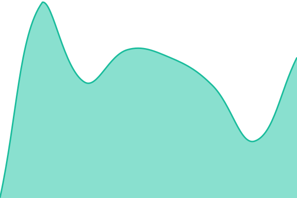
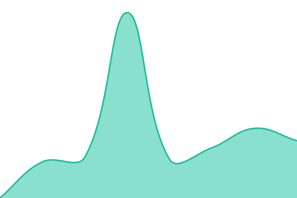
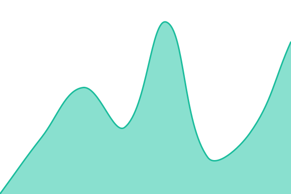

# [📋 Graph Technologies Service Status](https://graph-technologies.github.io/service-monitor/)

With [Upptime](https://upptime.js.org), you can get automated incident responses, status pages, and more directly from your GitHub repository.

<!--start: status pages-->
<!-- This summary is generated by Upptime (https://github.com/upptime/upptime) -->
<!-- Do not edit this manually, your changes will be overwritten -->
<!-- prettier-ignore -->
| URL | Status | History | Response Time | Uptime |
| --- | ------ | ------- | ------------- | ------ |
|  [Graph Technologies](https://graphtechnologies.xyz) | 🟩 Up | [graph-technologies.yml](https://github.com/graph-technologies/service-monitor/commits/HEAD/history/graph-technologies.yml) | 

 295ms
     
 | 

<a href="https://graphtechnologies.xyz/history/graph-technologies">100.00%</a>
    

|  [Graph Technologies - Contact](https://graphtechnologies.xyz/contact) | 🟩 Up | [graph-technologies-contact.yml](https://github.com/graph-technologies/service-monitor/commits/HEAD/history/graph-technologies-contact.yml) | 

 251ms
     
 | 

<a href="https://graphtechnologies.xyz/history/graph-technologies-contact">100.00%</a>
    

|  [Clara](https://clara.graphtechnologies.xyz) | 🟩 Up | [clara.yml](https://github.com/graph-technologies/service-monitor/commits/HEAD/history/clara.yml) | 

 499ms
     
 | 

<a href="https://graphtechnologies.xyz/history/clara">100.00%</a>
    

|  [Graph Technologies GitHub](https://github.com/graph-technologies) | 🟩 Up | [graph-technologies-git-hub.yml](https://github.com/graph-technologies/service-monitor/commits/HEAD/history/graph-technologies-git-hub.yml) | 

 714ms
     
 | 

<a href="https://graphtechnologies.xyz/history/graph-technologies-git-hub">100.00%</a>
    

|  [Graph Technologies LinkedIn](https://www.linkedin.com/company/graph-technologies-dk) | 🟩 Up | [graph-technologies-linked-in.yml](https://github.com/graph-technologies/service-monitor/commits/HEAD/history/graph-technologies-linked-in.yml) | 

 543ms
     
 | 

<a href="https://graphtechnologies.xyz/history/graph-technologies-linked-in">99.97%</a>
    

<!--end: status pages-->

[**Visit our status website →**](https://graph-technologies.github.io/service-monitor/)

## 🏢 About Us

[Graph Technologies](https://graphtechnologies.xyz) is a technology company focused on building innovative software solutions. We develop tools and platforms that help teams work smarter, including **Clara**, our AI-powered assistant.

## 📬 Contact

Have a question, found an issue, or want to get in touch? Reach out to us through any of the following channels:

- 🌐 **Contact form**: [graphtechnologies.xyz/contact](https://graphtechnologies.xyz/contact)
- 💼 **LinkedIn**: [linkedin.com/company/graph-technologies-dk](https://www.linkedin.com/company/graph-technologies-dk)
- 🐙 **GitHub**: [github.com/graph-technologies](https://github.com/graph-technologies)
